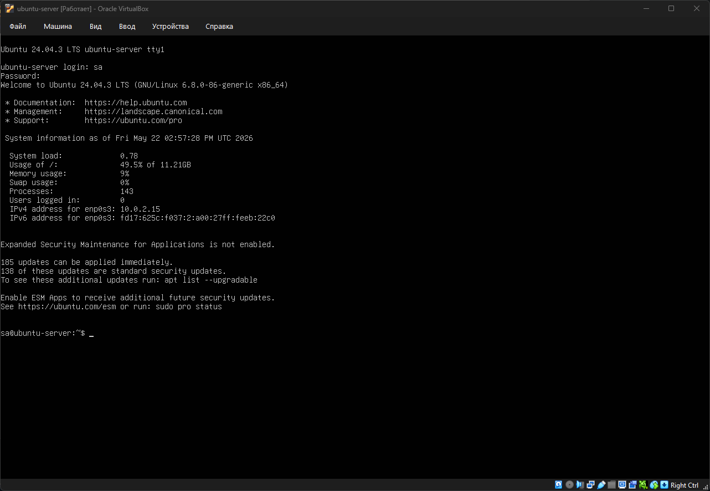
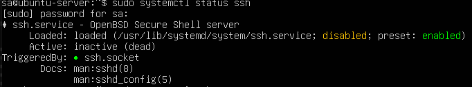
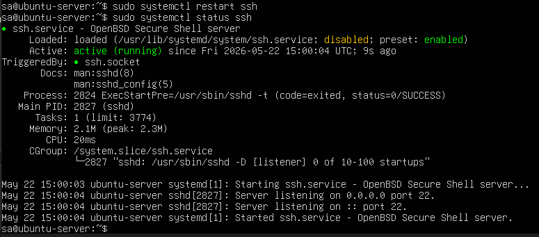
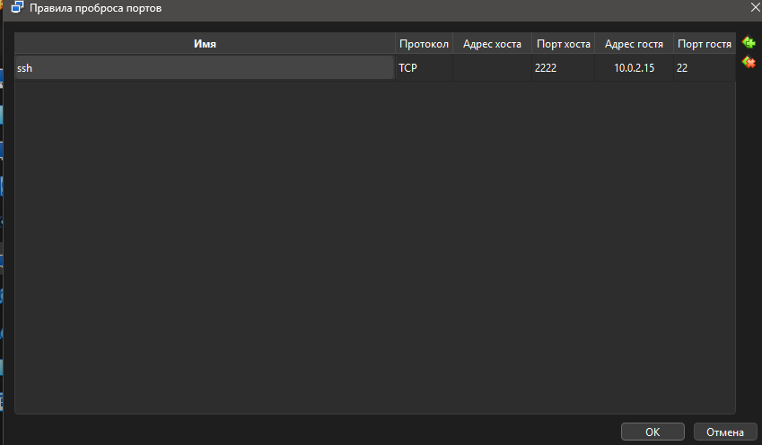
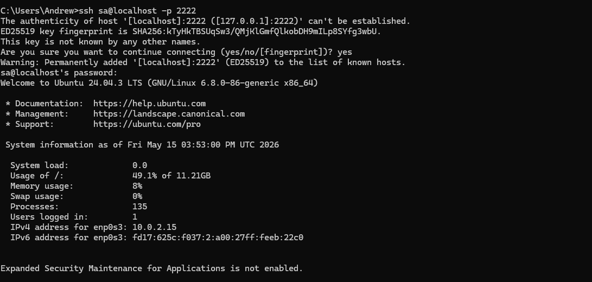

# Отчет по лабораторной работе №4.2: Настройка и администрирование SSH

## Цель работы
Получение практических навыков развертывания виртуальных машин, настройки сетевого взаимодействия (проброс портов) и конфигурирования служб SSH в операционных системах Linux и Windows.

---

## Ход выполнения работы

### Шаг 1. Развертывание виртуальной машины Ubuntu в VirtualBox

1. Скачан официальный образ операционной системы Ubuntu.
2. Произведена установка и запуск виртуальной машины внутри гипервизора Oracle VM VirtualBox.
   * 

### Шаг 2. Проверка службы SSH на сервере Ubuntu

1. После успешной загрузки системы выполнена проверка статуса SSH-сервера:
   ```bash
   sudo systemctl status ssh
   ```
2. Убедились, что служба активна (`active (running)`) и ожидает входящих подключений.
   * 
3. В случае, если служба неактивна, как показано выше, нужно выполнить перезагрузку:
   ```bash
   sudo systemctl restart ssh
   ```
   * 
### Шаг 3. Настройка сети и проброс портов (Port Forwarding)

1. Для доступа к изолированной виртуальной машине с хост-компьютера (Windows) открыты настройки сети ВМ (тип подключения: **NAT**).
2. В дополнительных настройках адаптера открыто меню **Проброс портов** и добавлено новое правило:
   * **Порт хоста:** `2222`
   * **Порт гостя:** `22`
   * 

### Шаг 4. Конфигурирование SSH-демона и изменение PermitRootLogin

1. Открыт конфигурационный файл службы SSHD с помощью текстового редактора `nano`:
   ```bash
   sudo nano /etc/ssh/sshd_config
   ```
2. Найден и изменен параметр для разрешения авторизации под пользователем `root`. Значение изменено на `yes`:
   ```text
   PermitRootLogin yes
   ```
   * 
3. Выполнен перезапуск службы для применения новых настроек конфигурации:
   ```bash
   sudo systemctl restart ssh
   ```
   * 

### Шаг 5. Установка и настройка OpenSSH в Windows PowerShell

1. На хост-машине запущен терминал **PowerShell от имени администратора**.
2. Выполнена проверка и установка клиентской и серверной части OpenSSH с помощью команд:
   ```powershell
   # Установка клиента OpenSSH
   Add-WindowsCapability -Online -Name OpenSSH.Client~~~~0.0.1.0
   
   # Установка сервера OpenSSH
   Add-WindowsCapability -Online -Name OpenSSH.Server~~~~0.0.1.0
   ```
### Шаг 6. Подключение к серверу через CMD

1. На хост-машине открыта командная строка (**CMD**).
2. Выполнено подключение к настроенной виртуальной машине Ubuntu через проброшенный ранее локальный порт `2222`:
   ```cmd
   ssh sa@localhost-p 2222
   ```
3. После ввода пароля суперпользователя `root` сессия успешно установилась, доступ к управлению сервером получен.
   * 

---

## Вывод
В ходе выполнения лабораторной работы были успешно освоены механизмы удаленного управления операционными системами по протоколу SSH. Изучены методы проброса портов в VirtualBox, конфигурация прав доступа (параметр `PermitRootLogin`) в файле `sshd_config`, а также развертывание и использование встроенных компонентов OpenSSH внутри экосистемы Windows.
